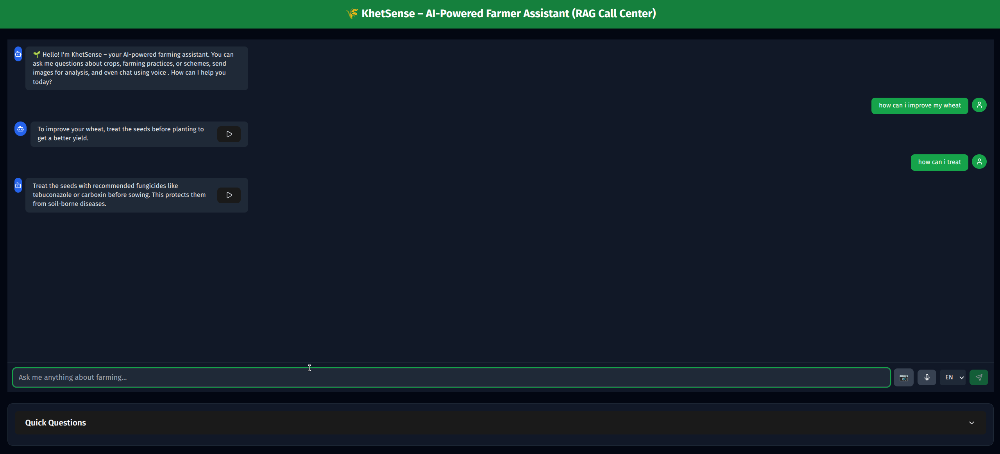

# 🌾 KhetSense - AI-Powered Farmer Assistant

An intelligent agricultural assistance platform that leverages RAG (Retrieval-Augmented Generation) technology to provide multilingual farming advice to Indian farmers.



## Introduction

KhetSense bridges the gap between modern AI technology and traditional farming practices in India. Built using the Kisan Call Center dataset, it provides contextual farming advice through text, voice, and image interactions in 7 Indian languages.

**Key Capabilities:**

- RAG-enhanced responses using agricultural knowledge base
- Voice interactions in Indian languages
- Visual crop disease detection
- Multilingual support (English, Hindi, Bengali, Telugu, Marathi, Tamil, Gujarati)

## Architecture

```
┌─────────────────┐    ┌──────────────────┐    ┌─────────────────┐
│   Frontend      │    │   Backend API    │    │   AI Services   │
│                 │    │                  │    │                 │
│ • React/TS UI   │◄──►│ • FastAPI        │◄──►│ • Google Gemini │
│ • Voice Record  │    │ • Session Mgmt   │    │ • Sarvam AI     │
│ • Image Upload  │    │ • Route Handlers │    │ • RAG System    │
└─────────────────┘    └──────────────────┘    └─────────────────┘
                                │
                                ▼
                       ┌─────────────────┐
                       │   Data Layer    │
                       │                 │
                       │ • Vector DB     │
                       │ • Kisan Dataset │
                       │ • Knowledge Base│
                       └─────────────────┘
```

## Features

### AI Intelligence

- **RAG System**: Retrieval-Augmented Generation using Kisan Call Center dataset
- **Multimodal AI**: Text and image understanding with Google Gemini 2.0 Flash
- **Context Awareness**: Maintains conversation history and farming context

### Voice & Audio

- **Speech-to-Text**: Voice queries using Sarvam AI
- **Text-to-Speech**: AI responses in user's preferred language
- **Real-time Processing**: Live audio recording and playback

### Visual Analysis

- **Image Upload**: Analyze crop/plant images
- **Disease Detection**: Identify crop diseases and pests
- **Health Assessment**: Get treatment recommendations

### Multilingual Support

- **7 Indian Languages**: English, Hindi, Bengali, Telugu, Marathi, Tamil, Gujarati
- **Auto-detection**: Identifies user's preferred language
- **Code-switching**: Handles mixed language inputs (Hinglish)

### Mobile-First Design

- **Responsive UI**: Optimized for smartphones and tablets
- **Touch-friendly**: Large buttons and accessible controls
- **Progressive Web App**: Can be installed on mobile devices

## Installation

### Prerequisites

- Python 3.8+
- Node.js 18+
- Git

### Backend Setup

1. **Clone and setup environment**

```bash
python -m venv venv
source venv/bin/activate  # Windows: venv\Scripts\activate
pip install -r requirements.txt
```

2. **Configure environment variables**

```bash
# Create .env file
GEMINI_API_KEY=your_google_gemini_api_key
SARVAM_API_KEY=your_sarvam_ai_api_key
```

3. **Start backend server**

```bash
uvicorn app:app --reload --port 8000
```

### Frontend Setup

1. **Install and configure**

```bash
cd farming-chatbot
npm install
echo "VITE_API_URL=http://localhost:8000" > .env
```

2. **Start development server**

```bash
npm run dev
```

3. **Access application**

- Frontend: <http://localhost:5173>
- Backend API: <http://localhost:8000>
- API Docs: <http://localhost:8000/docs>

## Usage

### Getting Started

1. Open <http://localhost:5173> in your browser
2. Select your preferred language from the 7 supported options
3. Choose interaction method:
   - **Text**: Type farming questions directly
   - **Voice**: Click microphone to speak your query
   - **Image**: Upload crop photos for disease analysis

### Example Interactions

**Text Query:**

```
Input: "What fertilizer for wheat in winter?"
Output: "Use DAP (18:46:0) at 100-150 kg/hectare during sowing, 
         followed by split urea application. Consider soil testing."
```

**Voice Query:** Speak in any supported language and receive audio responses

**Image Analysis:** Upload crop images to get disease identification and treatment advice

## API Reference

### Core Endpoints

| Endpoint | Method | Description |
|----------|--------|-------------|
| `/api/chat` | POST | Text chat with RAG |
| `/api/chat/image` | POST | Image analysis with text |
| `/api/audio-chat` | POST | Voice interaction |
| `/api/speak` | POST | Text-to-speech |
| `/api/transcribe` | POST | Speech-to-text |

### Example Request

```bash
curl -X POST "http://localhost:8000/api/chat" \
  -H "Content-Type: multipart/form-data" \
  -F "message=Best time to plant rice?" \
  -F "language=en-IN"
```

## Technology Stack

**Backend:**

- Python 3.8+ with FastAPI
- Google Gemini 2.0 Flash (AI)
- Sarvam AI (Speech processing)
- Sentence Transformers (Embeddings)

**Frontend:**

- React 19.1+ with TypeScript
- Vite (Build tool)
- Tailwind CSS (Styling)
- Framer Motion (Animations)

**AI/ML:**

- RAG with vector search
- Multimodal AI processing
- Text embeddings for semantic search

## Configuration

### API Keys Setup

**Google Gemini:**

1. Visit [Google AI Studio](https://makersuite.google.com/)
2. Create API key
3. Add to `.env` as `GEMINI_API_KEY`

**Sarvam AI:**

1. Visit [Sarvam AI](https://www.sarvam.ai/)
2. Generate API key
3. Add to `.env` as `SARVAM_API_KEY`

### Language Configuration

Modify supported languages in `chatbot.py`:

```python
SUPPORTED_LANGUAGES = ["en-IN", "hi-IN", "bn-IN", "te-IN", "mr-IN", "ta-IN", "gu-IN"]
```

## Contributing

1. Fork the repository
2. Create feature branch: `git checkout -b feature/new-feature`
3. Commit changes: `git commit -m "Add new feature"`
4. Push and create Pull Request

**Areas for contribution:**

- Additional Indian language support
- Performance optimizations
- Mobile experience improvements
- New AI model integrations
