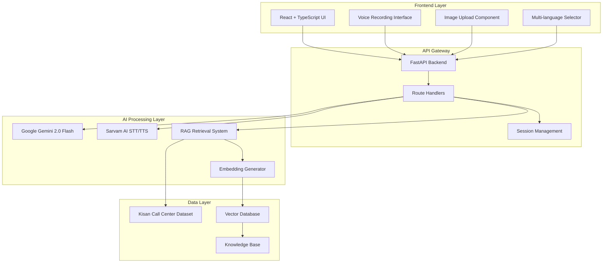

# 🌾 KhetSense – AI-Powered Farmer Assistant (RAG Call Center)

<div align="center">


**An intelligent, multi-modal agricultural assistance platform powered by RAG (Retrieval-Augmented Generation) technology**

[](https://python.org)
[](https://fastapi.tiangolo.com)
[](https://reactjs.org)
[](https://typescriptlang.org)
[](LICENSE)

[🚀 Live Demo](#demo) • [📖 Documentation](#documentation) • [🛠️ Installation](#installation) • [🤝 Contributing](#contributing)

</div>

---

## 📋 Table of Contents

- [🌟 Overview](#-overview)
- [✨ Features](#-features)
- [🏗️ Architecture](#️-architecture)
- [🛠️ Technology Stack](#️-technology-stack)
- [📦 Installation](#-installation)
- [🚀 Usage](#-usage)
- [🔧 Configuration](#-configuration)
- [📊 API Documentation](#-api-documentation)
- [🌐 Multi-Language Support](#-multi-language-support)
- [📱 Mobile Compatibility](#-mobile-compatibility)
- [🤝 Contributing](#-contributing)
- [📄 License](#-license)
- [👨‍💻 Author](#-author)

---

## 🌟 Overview

**KhetSense** is an advanced AI-powered agricultural assistance platform designed to bridge the gap between modern AI technology and traditional farming practices in India. This system leverages **Retrieval-Augmented Generation (RAG)** technology to provide accurate, contextual, and multilingual farming advice.

The platform integrates the **Kisan Call Center dataset** with cutting-edge AI models to deliver:
 📥 **[Download Kisan Call Center Dataset (Kaggle)](https://www.kaggle.com/datasets/daskoushik/farmers-call-query-data-qa/data)**

---

## ✨ Features

### 🤖 **AI-Powered Intelligence**
- **RAG-Enhanced Responses**: Retrieval-Augmented Generation using Kisan Call Center knowledge base
- **Google Gemini 2.0 Flash**: Advanced multimodal AI for text and image understanding
- **Context-Aware Conversations**: Maintains conversation history and context
- **Intelligent Query Processing**: Understands farming terminology and context

### 🎙️ **Voice & Audio Features**
- **Speech-to-Text (STT)**: Convert voice queries to text using Sarvam AI
- **Text-to-Speech (TTS)**: AI-generated voice responses in multiple languages
- **Real-time Audio Processing**: Live voice recording and playback
- **Audio Chat Integration**: Complete voice conversation workflow

### 📸 **Visual Intelligence**
- **Image Upload & Analysis**: Upload crop/plant images for AI analysis
- **Disease Detection**: Identify crop diseases and pests from images
- **Plant Health Assessment**: Get recommendations based on visual analysis
- **Multi-format Support**: JPEG, PNG, WebP image formats

### 🌐 **Multi-Language Support**
- **7 Indian Languages**: English, Hindi, Bengali, Telugu, Marathi, Tamil, Gujarati
- **Language Detection**: Automatic detection of user's preferred language
- **Localized Responses**: Culturally appropriate and region-specific advice
- **Code-switching Support**: Handles Hinglish and mixed language inputs

### 📱 **Responsive Design**
- **Mobile-First Approach**: Optimized for smartphones and tablets
- **Progressive Web App**: Works offline and can be installed
- **Touch-Friendly Interface**: Large buttons and touch-optimized controls
- **Cross-Platform Compatibility**: Works on iOS, Android, Windows, macOS

### 🚀 **Performance & Scalability**
- **Fast Response Times**: Optimized for quick query processing
- **Session Management**: Maintains conversation context across interactions
- **Caching**: Intelligent caching for frequently asked questions
- **Error Handling**: Robust error handling and fallback mechanisms

---

## 🏗️ Architecture



---

## 🛠️ Technology Stack

### **Backend Technologies**
| Technology | Purpose | Version |
|------------|---------|---------|
|  | Core Backend Language | 3.8+ |
|  | Web Framework | Latest |
|  | AI Language Model | 2.0 Flash |
|  | Speech Processing | Latest |
|  | Text Embeddings | Latest |
|  | Numerical Computing | Latest |
|  | Machine Learning | Latest |

### **Frontend Technologies**
| Technology | Purpose | Version |
|------------|---------|---------|
|  | UI Framework | 19.1+ |
|  | Type-Safe JavaScript | 5.0+ |
|  | Build Tool | Latest |
|  | Styling Framework | Latest |
|  | Animations | 12.23+ |
|  | Icon Library | Latest |

### **AI & ML Technologies**
- **Google Gemini 2.0 Flash**: Multimodal AI for text and image processing
- **Sarvam AI**: Speech-to-Text and Text-to-Speech in Indian languages
- **RAG (Retrieval-Augmented Generation)**: Enhanced AI responses with domain knowledge
- **Sentence Transformers**: Text embedding generation for semantic search
- **Vector Search**: Efficient similarity search for relevant information retrieval

---

## 📦 Installation

### **Prerequisites**

```bash
# Required Software
- Python 3.8 or higher
- Node.js 18 or higher
- npm or yarn
- Git
```

### **Backend Setup**

1. **Clone the Repository**
```bash
git clone https://github.com/ASTITVAAG2005/khetsense-rag-assistant.git
cd khetsense-rag-assistant
```

2. **Create Virtual Environment**
```bash
python -m venv venv
source venv/bin/activate  # On Windows: venv\Scripts\activate
```

3. **Install Python Dependencies**
```bash
pip install -r requirements.txt
```

4. **Environment Configuration**
```bash
# Create .env file in root directory
touch .env
```

Add the following to your `.env` file:
```env
# AI API Keys
GEMINI_API_KEY=your_google_gemini_api_key_here
SARVAM_API_KEY=your_sarvam_ai_api_key_here

```

5. **Start Backend Server**
```bash
uvicorn app:app --reload --port 8000
```

### **Frontend Setup**

1. **Navigate to Frontend Directory**
```bash
cd farming-chatbot
```

2. **Install Node Dependencies**
```bash
npm install
# or
yarn install
```

3. **Environment Configuration**
```bash
# Create .env file in frontend directory
touch .env
```

Add the following to your frontend `.env` file:
```env
VITE_API_URL=http://localhost:8000
```

4. **Start Frontend Development Server**
```bash
npm run dev
# or
yarn dev
```

5. **Access the Application**
```
Frontend: http://localhost:5173
Backend API: http://localhost:8000
API Documentation: http://localhost:8000/docs
```

---

## 🚀 Usage

### **Getting Started**

1. **Open the Application**: Navigate to `http://localhost:5173` in your web browser

2. **Choose Interaction Method**:
   - 💬 **Text Chat**: Type your farming questions
   - 🎤 **Voice Chat**: Click the microphone button to speak
   - 📷 **Image Analysis**: Upload crop/plant images for analysis

3. **Select Language**: Choose from 7 supported Indian languages

4. **Ask Questions**: Get expert advice on:
   - Crop management and farming practices
   - Disease identification and treatment
   - Fertilizer and pesticide recommendations
   - Government schemes and subsidies
   - Market prices and weather information

### **Sample Interactions**

#### **Text-based Queries**
```
User: "What fertilizer should I use for wheat in winter season?"
KhetSense: "For winter wheat cultivation, use DAP (18:46:0) at 100-150 kg per hectare during sowing, followed by urea application in 2-3 splits. Consider soil testing for precise recommendations."
```

#### **Voice Interactions**
- Speak in any supported language
- Get audio responses in the same language
- Perfect for farmers with limited literacy

#### **Image Analysis**
- Upload images of diseased crops
- Get instant disease identification
- Receive treatment recommendations

---

## 🔧 Configuration

### **API Keys Setup**

#### **Google Gemini API Key**
1. Visit [Google AI Studio](https://makersuite.google.com/)
2. Sign in with your Google account
3. Create a new API key
4. Add to `.env` file as `GEMINI_API_KEY`

#### **Sarvam AI API Key**
1. Visit [Sarvam AI](https://www.sarvam.ai/)
2. Sign up for an account
3. Generate API key from dashboard
4. Add to `.env` file as `SARVAM_API_KEY`

### **Customization Options**

#### **Language Configuration**
```python
# Modify supported languages in chatbot.py
SUPPORTED_LANGUAGES = [
    "en-IN",  # English
    "hi-IN",  # Hindi
    "bn-IN",  # Bengali
    "te-IN",  # Telugu
    "mr-IN",  # Marathi
    "ta-IN",  # Tamil
    "gu-IN"   # Gujarati
]
```

#### **System Prompt Customization**
```python
# Modify AI behavior in chatbot.py
_system_prompt = (
    "You are KhetSense AI, a friendly and knowledgeable AI-powered assistant for Indian farmers..."
)
```

---

## 📊 API Documentation

### **Core Endpoints**

#### **Chat Endpoints**

| Endpoint | Method | Description |
|----------|--------|-------------|
| `/api/chat` | POST | Text-only chat with RAG |
| `/api/chat/image` | POST | Image + text analysis |
| `/api/audio-chat` | POST | Complete voice interaction |

#### **Speech Processing**

| Endpoint | Method | Description |
|----------|--------|-------------|
| `/api/speak` | POST | Text-to-Speech conversion |
| `/api/transcribe` | POST | Speech-to-Text conversion |

#### **Utility Endpoints**

| Endpoint | Method | Description |
|----------|--------|-------------|
| `/api/health` | GET | Service health check |
| `/api/chat/reset` | POST | Reset conversation session |

### **Request/Response Examples**

#### **Text Chat**
```bash
curl -X POST "http://localhost:8000/api/chat" \
  -H "Content-Type: multipart/form-data" \
  -F "message=What is the best time to plant rice?" \
  -F "language=en-IN"
```

**Response:**
```json
{
  "response": "The best time to plant rice is during the monsoon season, typically from June to July. Ensure adequate water availability and prepare the field 2-3 weeks before sowing.",
  "session_id": "uuid-session-id"
}
```

#### **Image Analysis**
```bash
curl -X POST "http://localhost:8000/api/chat/image" \
  -H "Content-Type: multipart/form-data" \
  -F "image=@crop_disease.jpg" \
  -F "message=What disease is affecting my crop?" \
  -F "language=en-IN"
```

---

## 🌐 Multi-Language Support

KhetSense supports **7 Indian languages** with native script and cultural context:

| Language | Code | Script | Voice Support |
|----------|------|--------|---------------|
| English | en-IN | Latin | ✅ |
| Hindi | hi-IN | Devanagari | ✅ |
| Bengali | bn-IN | Bengali | ✅ |
| Telugu | te-IN | Telugu | ✅ |
| Marathi | mr-IN | Devanagari | ✅ |
| Tamil | ta-IN | Tamil | ✅ |
| Gujarati | gu-IN | Gujarati | ✅ |

### **Language Features**
- **Automatic Detection**: AI detects user's preferred language
- **Code-switching**: Handles mixed language inputs (Hinglish)
- **Cultural Context**: Responses adapted to regional farming practices
- **Voice Support**: STT/TTS available in all supported languages

---

## 📱 Mobile Compatibility

### **Responsive Design Features**
- ✅ **Mobile-First**: Optimized for smartphone screens
- ✅ **Touch-Friendly**: Large buttons and touch targets
- ✅ **Progressive Web App**: Can be installed on mobile devices
- ✅ **Offline Capability**: Basic functionality works offline
- ✅ **Voice Interface**: Perfect for users with limited literacy

### **Mobile-Specific Optimizations**
```css
/* Mobile optimizations in index.css */
@media (max-width: 640px) {
  input[type="text"] { font-size: 16px !important; }
  button { min-height: 44px; min-width: 44px; }
}
```

### **Cross-Platform Testing**
- **iOS Safari**: Fully compatible
- **Android Chrome**: Optimized performance
- **Mobile Firefox**: Complete functionality
- **Samsung Internet**: Tested and verified

---

## 🤝 Contributing

We welcome contributions from the community! Here's how you can help:

### **How to Contribute**

1. **Fork the Repository**
```bash
git fork https://github.com/ASTITVAAG2005/khetsense-rag-assistant.git
```

2. **Create Feature Branch**
```bash
git checkout -b feature/your-feature-name
```

3. **Make Changes**
```bash
# Make your improvements
git add .
git commit -m "Add: Your feature description"
```

4. **Submit Pull Request**
```bash
git push origin feature/your-feature-name
```

### **Contribution Guidelines**

- **Code Style**: Follow PEP 8 for Python, ESLint for TypeScript
- **Documentation**: Update README and code comments
- **Testing**: Add tests for new features
- **Language Support**: Help add more Indian languages

### **Areas for Contribution**

- 🌐 **Additional Language Support**: Add more Indian regional languages
- 🧠 **AI Model Improvements**: Enhance RAG performance
- 📱 **Mobile Features**: Improve mobile user experience
- 🔧 **Performance Optimization**: Optimize response times
- 📊 **Analytics**: Add usage analytics and insights
- 🔒 **Security**: Enhance security features

---

## 📄 License

This project is licensed under the **MIT License** - see the [LICENSE](LICENSE) file for details.

```
MIT License

Copyright (c) 2025 Astitva Agarwal

Permission is hereby granted, free of charge, to any person obtaining a copy
of this software and associated documentation files (the "Software"), to deal
in the Software without restriction, including without limitation the rights
to use, copy, modify, merge, publish, distribute, sublicense, and/or sell
copies of the Software, and to permit persons to whom the Software is
furnished to do so, subject to the following conditions:

The above copyright notice and this permission notice shall be included in all
copies or substantial portions of the Software.
```

---

## 👨‍💻 Author

<div align="center">

### **Astitva Agarwal**
*Data Science & Artificial Intelligence Student*  
*Indian Institute of Technology Madras*

[](https://github.com/ASTITVAAG2005)
[](https://www.linkedin.com/in/astitva-agarwal-b587422a6)
[](mailto:astitvaag2005@gmail.com)

</div>

### **Project Context**
This project was developed by the student  at **IIT Madras**, focusing on:
- **RAG Implementation**: Practical application of Retrieval-Augmented Generation
- **Multi-modal AI**: Integration of text, voice, and image processing
- **Real-world Impact**: Addressing agricultural challenges in India
- **Full-stack Development**: End-to-end application development

---

<div align="center">

### **🌾 Empowering Farmers with AI Technology 🌾**

**KhetSense** bridges the digital divide in agriculture, making advanced AI accessible to every farmer across India through voice, text, and visual interfaces.

*Built with ❤️ for the farming community of India*

---

⭐ **Star this repository if you found it helpful!** ⭐

</div>